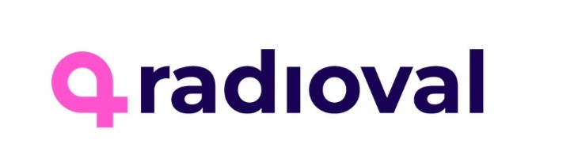
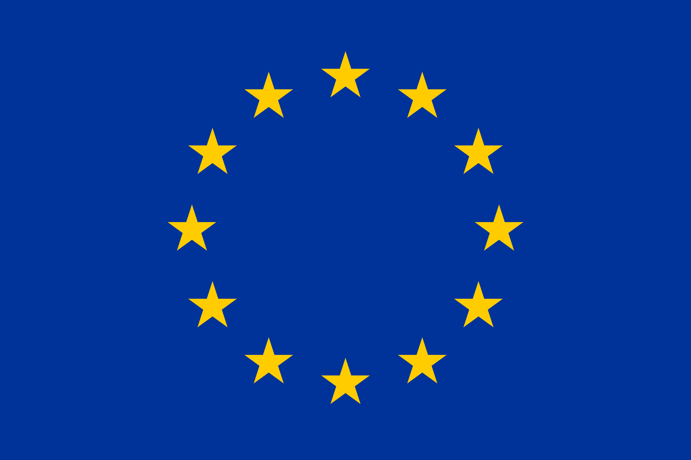

# RadioVal 

## About the project 

Breast cancer is now the most common cancer worldwide, surpassing lung cancer in 2020 for the first time. Neoadjuvant chemotherapy (NAC) has shown promise in reducing mortality for advanced cases, but the therapy is associated with a high rate of over-treatment, as well as with significant side effects for the patients. For predicting NAC respondents and improving patient selection, artificial intelligence (AI) approaches based on radiomics have shown promising preclinical evidence, but existing studies have mostly focused on evaluating model accuracy, all-too often in homogeneous populations. RadioVal is the first multi-centre, multi-continental and multi-faceted clinical validation of radiomics driven estimation of NAC response in breast cancer.  

## Our collaborators

The project builds on the repositories, tools and results of five EU-funded projects from the AI for Health Imaging (AI4HI) Network, including a large multi-centre cancer imaging dataset on NAC treatment in breast cancer. To test applicability as well as transferability, the validation with take place in eight clinical centres from three high-income EU countries (Sweden, Austria, Spain), two emerging EU countries (Poland, Croatia), and three countries from South America (Argentina), North Africa (Egypt) and Eurasia (Turkey). 

## Our goal

RadioVal will develop a comprehensive and standardised methodological framework for multi-faceted radiomics evaluation based on the FUTURE-AI Guidelines, to assess Fairness, Universality, Traceability, Usability, Robustness and Explainability. The project will also introduce new tools to enable transparent and continuous evaluation and monitoring of the radiomics tools over time. The RadioVal study will be implemented through a multi-stakeholder approach, taking into account clinical and healthcare needs, as well as socio-ethical and regulatory requirements from day one.

  

